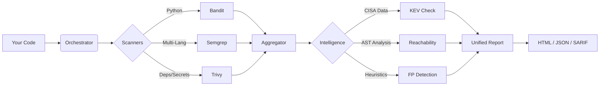

# 🛡️ Security Assistant

**Enterprise-grade security orchestration for everyone. No license required.**

[](https://opensource.org/licenses/MIT)
[](https://www.python.org/downloads/)
[](https://github.com/AMEOBIUS/security-assistant/actions)
[](https://github.com/psf/black)

**Security Assistant** allows you to run a GitLab Ultimate-level security pipeline locally or in any CI/CD. It orchestrates multiple scanners (Bandit, Semgrep, Trivy), deduplicates findings, and prioritizes them using **Context Intelligence** (KEV, Reachability, False Positive Detection).

### 🎯 Who is this for?
*   **Developers:** Get immediate security feedback without waiting for the CI pipeline.
*   **SecOps:** Get a unified report from multiple tools without writing glue code.
*   **Startups:** Access enterprise security features (SAST, SCA, Secrets) for $0.

---

## ⚡ Quick Start

Get running in seconds.

### 1. Install
```bash
pip install security-assistant
# Or if you use pipx (recommended)
pipx install security-assistant
```

### 2. Scan
```bash
# Scan current directory
security-assistant scan .
```

### 3. View Report
Open `security-reports/report.html` in your browser to see the interactive dashboard.

---

## 🏗️ How It Works



---

## 🚀 Why Security Assistant?

Why not just run the tools individually?

| Feature | Standalone Tools | Security Assistant |
| :--- | :---: | :---: |
| **Unified Output** | ❌ Separate formats | ✅ Single JSON/HTML/SARIF |
| **Noise Reduction** | ❌ High | ✅ Low (Deduplication + FP Detection) |
| **Prioritization** | ❌ Severity only | ✅ Severity + **KEV** + **Reachability** |
| **Remediation** | ⚠️ Basic messages | ✅ **Code Examples** & Fix Templates |
| **Setup Time** | 🕒 Hours (configs, scripts) | ⚡ **Seconds** (one command) |

### Key Capabilities
1.  **Intelligent Orchestration**: Runs scanners in parallel, handles timeouts, and normalizes results.
2.  **Context Awareness**:
    *   **KEV**: "Is this CVE actively exploited in the wild?" (Source: CISA)
    *   **Reachability**: "Do we actually import this vulnerable library?"
    *   **FP Detection**: "Is this just test code or a mock?"
3.  **CI/CD Ready**: Outputs SARIF for GitHub Security tab and GitLab Code Quality JSON.

---

## 🤖 CI/CD Integration

Copy-paste these into your pipeline.

### GitHub Actions
```yaml
name: Security Scan
on: [push, pull_request]
jobs:
  security:
    runs-on: ubuntu-latest
    steps:
      - uses: actions/checkout@v3
      - name: Set up Python
        uses: actions/setup-python@v4
        with:
          python-version: '3.11'
      - name: Install Security Assistant
        run: pip install security-assistant
      - name: Install Scanners
        run: |
          pip install bandit semgrep
          # Install Trivy (see docs/installation.md)
      - name: Run Scan
        run: security-assistant scan . --preset ci --format sarif
      - name: Upload SARIF
        uses: github/codeql-action/upload-sarif@v2
        with:
          sarif_file: security-reports/report.sarif
```

### GitLab CI
```yaml
security_scan:
  image: python:3.11
  script:
    - pip install security-assistant
    - security-assistant scan . --preset ci --format json
  artifacts:
    reports:
      codequality: security-reports/report.json
```

---

## 📚 Documentation

- [Installation Guide](docs/installation.md)
- [Configuration Guide](docs/configuration.md)
- [Scanner Documentation](docs/scanners/)
- [CI/CD Integration](docs/integrations/)

---

## 🤝 Contributing

We love contributions! Here's how you can help:

1.  **Fork** the repository.
2.  **Create** a feature branch.
3.  **Submit** a Pull Request.

See [CONTRIBUTING.md](CONTRIBUTING.md) for details.

### Looking for something to do?
- 🔍 [Find "Good First Issues"](https://github.com/AMEOBIUS/security-assistant/labels/good%20first%20issue)
- 💡 [Request a Feature](https://github.com/AMEOBIUS/security-assistant/issues/new?template=feature_request.md)

---

## 📄 License

This project is licensed under the MIT License - see the [LICENSE](LICENSE) file for details.

---

**Disclaimer**: This tool is for defensive security purposes only. Use responsibly.

