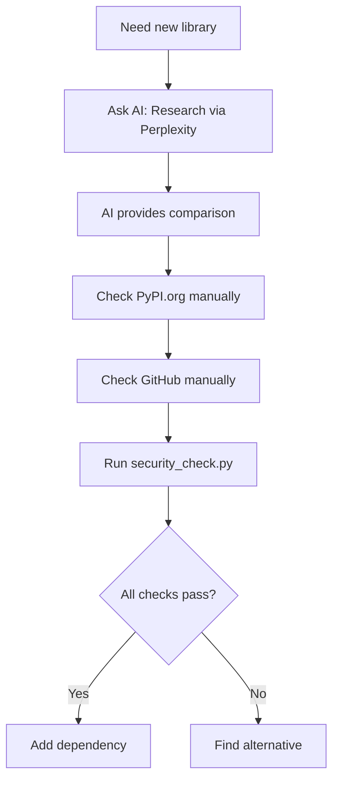
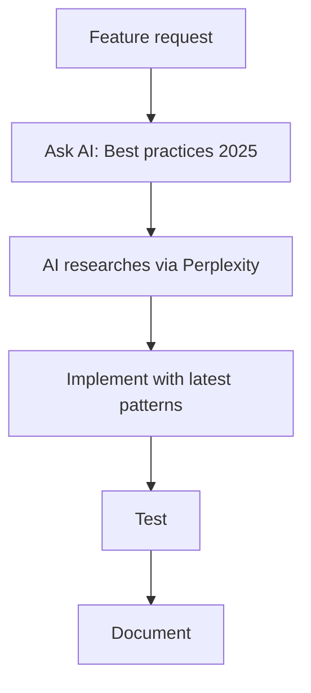

# MCP Servers Setup for Security Workstation

## 🎯 Recommended Integration Approach

### Current Available Tools

**1. Perplexity MCP** (Already integrated)
- ✅ Real-time research
- ✅ Latest trends and best practices
- ✅ Available through GitLab Duo

**2. security_check.py** (Existing)
- ✅ CVE scanning
- ✅ Package version validation
- ✅ Works offline

**3. Manual Package Research Workflow**

Since dedicated MCP servers may not be available, use this workflow:

```python
# Before adding dependency:

# 1. Research with Perplexity (through GitLab Duo)
# Ask: "Compare Python HTTP clients 2025: requests vs httpx vs aiohttp"

# 2. Check PyPI manually
# Visit: https://pypi.org/project/httpx/
# Check: Latest version, last update, downloads

# 3. Check GitHub manually  
# Visit: https://github.com/encode/httpx
# Check: Stars, last commit, open issues, activity

# 4. Security scan
!python scripts/security_check.py python httpx

# 5. Decision based on all factors
```

---

## 🔄 Practical Actualization Workflow

### Step 1: Research (Perplexity via GitLab Duo)

Ask AI agent:
```
"Research best practices for [technology] in 2025-2026"
"Compare [library A] vs [library B] for [use case]"
"Latest security trends in [domain]"
```

### Step 2: Verify Package Health

**Manual checks:**
- PyPI: https://pypi.org/project/PACKAGE/
- GitHub: https://github.com/ORG/REPO
- Security: `python scripts/security_check.py python PACKAGE`

**Automated:**
```bash
# Audit all dependencies
python scripts/audit_dependencies.py
```

### Step 3: Implement with Latest Patterns

Use patterns from Perplexity research + official docs.

---

## 🔄 Actualization Workflow (Practical)

### Before Adding ANY Dependency



### Before Writing Code



---

## 📋 Quick Reference

**Available Now:**
- ✅ Perplexity (via GitLab Duo) - Research & best practices
- ✅ security_check.py - CVE scanning
- ✅ audit_dependencies.py - Automated audit

**Manual Checks:**
- 📦 PyPI: https://pypi.org/project/PACKAGE/
- 🐙 GitHub: https://github.com/ORG/REPO
- 🔒 CVE: https://nvd.nist.gov/

**Workflow:**
1. Ask AI to research (Perplexity via GitLab Duo)
2. Check package health (PyPI + GitHub)
3. Security scan (`security_check.py`)
4. Implement with latest patterns

---

## 🎯 Usage Examples

### Example 1: Adding New Scanner (Practical)

```python
# 1. Ask AI to research
# User: "Research best SAST tools 2025-2026 for Python"
# AI uses Perplexity → Returns comparison: Bandit vs Semgrep vs Ruff

# 2. Check PyPI manually
# Visit: https://pypi.org/project/semgrep/
# Latest version: 1.95.0
# Last update: 2025-11-15
# Downloads: 500k+/month ✅

# 3. Check GitHub manually
# Visit: https://github.com/semgrep/semgrep
# Stars: 10k+
# Last commit: 2 days ago
# Issues: 200 open (active community) ✅

# 4. Security check
!python scripts/security_check.py python semgrep
# CVE scan: Clean ✅

# 5. Add dependency
# requirements.txt: semgrep==1.95.0
```

### Example 2: Implementing New Feature (Practical)

```python
# 1. Ask AI to research
# User: "Best practices for async task queue Python 2025"
# AI researches via Perplexity
# Result: Celery vs RQ vs Dramatiq comparison with pros/cons

# 2. Manual verification
# Check PyPI for each:
# - celery: v5.4.0, updated 2025-10-20
# - dramatiq: v1.17.0, updated 2025-09-15
# - rq: v1.16.0, updated 2025-08-10

# 3. GitHub activity check
# - celery: 24k stars, active
# - dramatiq: 4k stars, active
# - rq: 9k stars, moderate

# 4. Security scan all candidates
!python scripts/security_check.py python celery
!python scripts/security_check.py python dramatiq
!python scripts/security_check.py python rq

# 5. Decision based on:
# - AI research (Perplexity insights)
# - Package health (PyPI + GitHub)
# - Security (CVE scan)
# - Project requirements

# 6. Implement with latest patterns from AI research
```

---

## 🔍 Automated Dependency Audit Script

**scripts/audit_dependencies.py:**
```python
#!/usr/bin/env python3
"""
Automated dependency audit using MCP servers
"""
import subprocess
import json

def audit_dependency(package_name):
    """Audit single dependency"""
    print(f"\\n🔍 Auditing {package_name}...")
    
    # 1. PyPI check (if MCP available)
    # pypi_info = mcp__pypi__get_package_info(package_name)
    
    # 2. Security check
    result = subprocess.run(
        ["python", "scripts/security_check.py", "python", package_name],
        capture_output=True,
        text=True
    )
    
    # 3. GitHub check (if MCP available)
    # github_info = mcp__github__get_repo_info(f"org/{package_name}")
    
    return {
        "package": package_name,
        "security": "clean" if result.returncode == 0 else "vulnerable",
        "output": result.stdout
    }

def audit_all_dependencies():
    """Audit all dependencies from requirements.txt"""
    with open("requirements.txt") as f:
        packages = [line.split("==")[0].strip() 
                   for line in f 
                   if line.strip() and not line.startswith("#")]
    
    results = []
    for package in packages:
        results.append(audit_dependency(package))
    
    # Generate report
    print("\\n" + "="*50)
    print("📊 DEPENDENCY AUDIT REPORT")
    print("="*50)
    
    vulnerable = [r for r in results if r["security"] == "vulnerable"]
    if vulnerable:
        print(f"\\n⚠️  VULNERABLE: {len(vulnerable)} packages")
        for r in vulnerable:
            print(f"  - {r['package']}")
    else:
        print("\\n✅ All dependencies clean!")
    
    return results

if __name__ == "__main__":
    audit_all_dependencies()
```

**Usage:**
```bash
# Audit all dependencies
python scripts/audit_dependencies.py

# Schedule weekly audit
# crontab: 0 9 * * 1 cd /path/to/workstation && python scripts/audit_dependencies.py
```

---

## 🎓 Training: How to Use This System

### For AI Agent (Builder Mode)

**Rule:** Before implementing ANY feature:

1. **Research** → Ask user to let you research via Perplexity
2. **Check versions** → Guide user to check PyPI/GitHub manually
3. **Security scan** → Run security_check.py
4. **Implement** → Use latest patterns from research

### For Developers

**Workflow:**
```bash
# 1. Need new library?
# Ask AI: "Research best Python HTTP clients 2025"

# 2. AI researches via Perplexity (GitLab Duo)
# Returns: httpx vs requests vs aiohttp comparison

# 3. Developer checks manually:
# - PyPI: https://pypi.org/project/httpx/
# - GitHub: https://github.com/encode/httpx

# 4. AI runs security check
python scripts/security_check.py python httpx

# 5. AI recommends based on all data
# "Use httpx 0.27.0 - modern, async, actively maintained, no CVEs"

# 6. Developer adds dependency
echo "httpx==0.27.0" >> requirements.txt
```

---

## 📈 Benefits

**Before This System:**
- ❌ Outdated libraries
- ❌ Manual version checks
- ❌ Security vulnerabilities
- ❌ Deprecated patterns

**After This System:**
- ✅ AI-assisted research (Perplexity via GitLab Duo)
- ✅ Structured verification workflow
- ✅ Automated security scanning
- ✅ Modern patterns from latest research

---

## 🚀 Next Steps

1. **Use AI for research** - Ask GitLab Duo to research via Perplexity
2. **Manual verification** - Check PyPI + GitHub for package health
3. **Automated security** - Run `audit_dependencies.py` weekly
4. **CI/CD integration** - Add audit to pipeline
5. **Team training** - Share this workflow

---

**One dependency = One full verification cycle**
